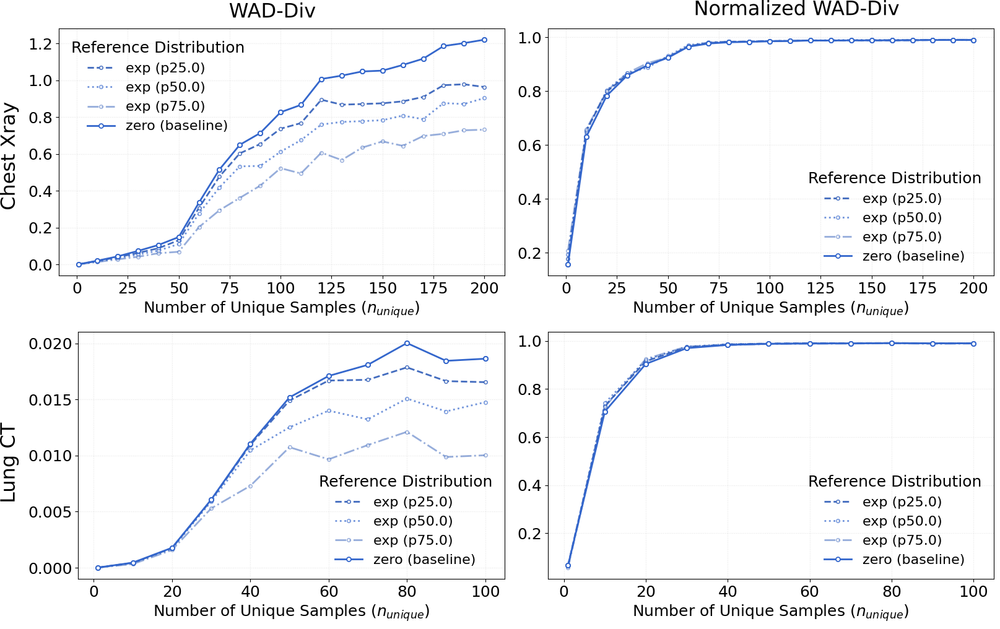
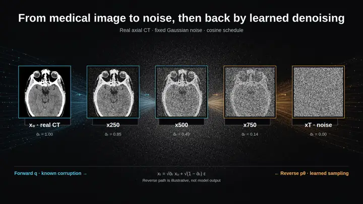

<div id="main-content" class="site-home">
<section class="site-hero site-shell" aria-labelledby="hero-title">
<div class="site-hero__copy">
<p class="eyebrow">3D + 4D generative medical imaging</p>
<h1 id="hero-title">Efficient generative models for medical imaging.</h1>
<p class="site-lead">I study high-resolution volumetric and temporal medical-image generation, synthetic-data evaluation, and trustworthy research workflows.</p>
<div class="action-row" aria-label="Explore the site">
<a class="site-button site-button--primary" href="research.qmd">Explore research</a>
<a class="site-button site-button--secondary" href="publications.qmd">View publications</a>
</div>
</div>

<figure class="paper-figure paper-figure--hero">
<a class="paper-figure__image-link" href="assets/paper-figures/cardiodit-figure-1-framework.jpg">

</a>
<figcaption>
<span class="eyebrow">Figure 1 / CardioDiT</span>
<a class="paper-figure__source" href="https://arxiv.org/abs/2603.25194">Figure 1 — CardioDiT framework for 4D cardiac MRI synthesis.</a>
<span class="paper-figure__provenance">Source: Seyfarth et al. (2026).</span>
<a class="paper-figure__full" href="assets/paper-figures/cardiodit-figure-1-framework.jpg">Open full-resolution figure</a>
</figcaption>
</figure>
</section>

<section class="site-section site-shell" aria-labelledby="coordinates-title">
<div class="section-heading">
<p class="eyebrow">01 / research coordinates</p>
<h2 id="coordinates-title">Where the work is organised</h2>
</div>
<div class="coordinate-list">
<article class="coordinate-row">
<p class="coordinate-label">X / Y / Z / T</p>
<div>
<h3>Volume + time</h3>
<p>Efficient high-resolution 3D and 4D generation for volumetric and temporal medical imaging.</p>
</div>
<a href="research.qmd">Explore generation <span aria-hidden="true">→</span></a>
</article>
<article class="coordinate-row">
<p class="coordinate-label">EVAL</p>
<div>
<h3>Evaluation beyond realism</h3>
<p>Fidelity alongside diversity, memorisation, privacy, anatomy, and downstream utility.</p>
</div>
<a href="research.qmd">Explore evaluation <span aria-hidden="true">→</span></a>
</article>
<article class="coordinate-row">
<p class="coordinate-label">TRACE</p>
<div>
<h3>Research systems</h3>
<p>Reproducible links between evidence, experiments, code, and scientific communication.</p>
</div>
<a href="research.qmd">Explore systems <span aria-hidden="true">→</span></a>
</article>
</div>
</section>

<section class="site-section site-shell" aria-labelledby="selected-work-title">
<div class="section-heading section-heading--split">
<div>
<p class="eyebrow">02 / selected work</p>
<h2 id="selected-work-title">Three views of a shared question</h2>
</div>
<a class="text-link" href="publications.qmd">View all publications <span aria-hidden="true">→</span></a>
</div>

<div class="work-plates">
<article class="work-plate work-plate--wide">
```{=html}
<figure class="work-plate__figure paper-figure">
<a class="paper-figure__image-link" href="assets/paper-figures/cardiodit-figure-1-framework.jpg">

</a>
<figcaption>
<span class="eyebrow">Figure 1 / CardioDiT</span>
<a class="paper-figure__source" href="https://arxiv.org/abs/2603.25194">Figure 1 — CardioDiT framework for 4D cardiac MRI synthesis.</a>
<span class="paper-figure__provenance">Source: Seyfarth et al. (2026).</span>
<a class="paper-figure__full" href="assets/paper-figures/cardiodit-figure-1-framework.jpg">Open full-resolution figure</a>
</figcaption>
</figure>
```
<div class="work-plate__body">
<p class="eyebrow">4D cardiac MRI · Framework figure</p>
<h3>CardioDiT: Latent Diffusion Transformers for 4D Cardiac MRI Synthesis</h3>
<p>A fully 4D latent-diffusion framework for short-axis cine CMR synthesis.</p>
<ul class="tag-list" aria-label="Research themes"><li>4D</li><li>latent diffusion</li><li>transformers</li></ul>
<p class="work-meta">arXiv preprint</p>
<p class="work-actions"><a href="https://arxiv.org/abs/2603.25194">Paper</a><a href="https://github.com/Cardio-AI/cardiodit">Code</a></p>
</div>
</article>

<article class="work-plate">
```{=html}
<figure class="work-plate__figure paper-figure">
<a class="paper-figure__image-link" href="assets/paper-figures/voldit-figure-1-framework.jpg">

</a>
<figcaption>
<span class="eyebrow">Figure 1 / VolDiT</span>
<a class="paper-figure__source" href="https://arxiv.org/abs/2603.25181">Figure 1 — VolDiT framework with timestep-gated spatial control.</a>
<span class="paper-figure__provenance">Source: Seyfarth et al. (2026).</span>
<a class="paper-figure__full" href="assets/paper-figures/voldit-figure-1-framework.jpg">Open full-resolution figure</a>
</figcaption>
</figure>
```
<div class="work-plate__body">
<p class="eyebrow">Volumetric synthesis · Framework figure</p>
<h3>VolDiT: Controllable Volumetric Medical Image Synthesis with Diffusion Transformers</h3>
<p>Transformer-based 3D medical-image synthesis with mask-based spatial control.</p>
<ul class="tag-list" aria-label="Research themes"><li>3D</li><li>patch tokens</li><li>control</li></ul>
<p class="work-meta">arXiv preprint</p>
<p class="work-actions"><a href="https://arxiv.org/abs/2603.25181">Paper</a><a href="https://github.com/Cardio-AI/voldit">Code</a></p>
</div>
</article>

<article class="work-plate">
```{=html}
<figure class="work-plate__figure paper-figure">
<a class="paper-figure__image-link" href="assets/paper-figures/wad-div-figure-2-intrinsic-diversity.png">

</a>
<figcaption>
<span class="eyebrow">Figure 2 / WAD-Div</span>
<a class="paper-figure__source" href="https://doi.org/10.1007/978-3-658-51100-5_83">Figure 2 — Intrinsic dataset diversity measured with WAD-Div.</a>
<span class="paper-figure__provenance">Source: Seyfarth, Dar &amp; Engelhardt (2026).</span>
<a class="paper-figure__full" href="assets/paper-figures/wad-div-figure-2-intrinsic-diversity.png">Open full-resolution figure</a>
</figcaption>
</figure>
```
<div class="work-plate__body">
<p class="eyebrow">Diversity evaluation · Result figure</p>
<h3>Rethinking Diversity Metrics in Medical Imaging with Wasserstein Distance</h3>
<p>A feature-space diversity metric for medical-image datasets.</p>
<ul class="tag-list" aria-label="Research themes"><li>evaluation</li><li>diversity</li><li>feature space</li></ul>
<p class="work-meta">BVM Workshop 2026 · version of record</p>
<p class="work-actions"><a href="https://doi.org/10.1007/978-3-658-51100-5_83">Publication</a><span class="code-state">No public code repository</span></p>
</div>
</article>
</div>
</section>

<section class="site-section site-shell" aria-labelledby="evaluation-title">
<div class="section-heading">
<p class="eyebrow">03 / evaluation lens</p>
<h2 id="evaluation-title">A calibration, not a scorecard</h2>
<p class="section-intro">A useful account of synthetic medical images asks more than whether a single slice looks plausible.</p>
</div>
```{=html}
<div class="evaluation-rail" aria-label="Conceptual evaluation concerns">
<span>Fidelity</span><span>Diversity</span><span>Memorisation</span><span>Privacy</span><span>Anatomy</span><span>Downstream utility</span>
</div>
```
<p><a class="text-link" href="research.qmd">Read the research directions <span aria-hidden="true">→</span></a></p>
</section>

<section class="site-section site-shell research-note" aria-labelledby="research-note-title">
<figure class="research-note__image">

<figcaption>Real CC0 axial head CT by <a href="https://commons.wikimedia.org/wiki/File:CT_of_a_normal_brain,_axial_25.png">Mikael Häggström, M.D., via Wikimedia Commons (CC0 1.0)</a>, shown through a deterministic noising sequence. Visual treatment created with GPT Image 2; CT pixels and diffusion states were composed deterministically. An educational visualisation, not model output.</figcaption>
</figure>
<div class="research-note__copy">
<p class="eyebrow">Research note / foundations</p>
<h2 id="research-note-title">Diffusion Models for Medical Image Synthesis: From Noise to Anatomy</h2>
<p>Why denoising, conditioning, latent spaces, and evaluation matter for synthetic medical images.</p>
<a class="site-button site-button--secondary" href="posts/diffusion-models-medical-image-synthesis/index.qmd">Read the research note</a>
</div>
</section>

<section class="site-closing site-shell" aria-labelledby="closing-title">
<p class="eyebrow">04 / continue reading</p>
<h2 id="closing-title">Research themes, publications, and notes—kept close to their evidence and context.</h2>
<p><a class="text-link" href="about.qmd">About this site <span aria-hidden="true">→</span></a> <a class="text-link" href="https://github.com/marseyf">GitHub <span aria-hidden="true">→</span></a></p>
</section>
</div>
