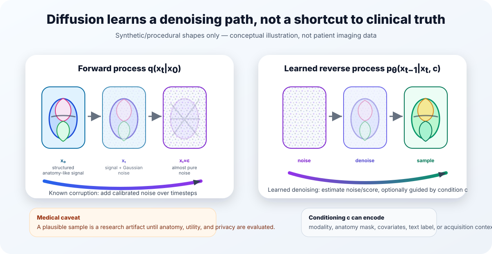

## The question

Medical image synthesis is tempting for almost every bottleneck in biomedical machine learning. We would like more examples of rare anatomy, balanced cohorts for model development, realistic volumes for simulation, and shareable data for reproducible research. At the same time, medical images are not interchangeable with internet photographs. They are high-dimensional measurements of people, acquired under scanner protocols, reconstructed through modality-specific physics, embedded in clinical context, and governed by privacy and release constraints.

That is why diffusion models are interesting in medicine, but also why they are easy to oversell. The important question is not whether a model can draw a plausible-looking CT or MRI slice. The better question is: what does the model learn when it turns noise into anatomy-like structure, and which parts of the diffusion toolbox actually matter for medical synthesis?

My view is that diffusion models are useful here because they match the problem with a conservative modelling contract. They start from a known corruption process, learn many small denoising steps, and can be conditioned on medically meaningful context. But clinical relevance depends on the rest of the system: representation, conditioning, volumetric coherence, evaluation, privacy checks, and governance. The denoiser is only the center of a larger pipeline.

::: {.callout-tip title="Key takeaways"}
- A diffusion model is best understood as a learned denoising process, not as a direct image renderer.
- The light mathematical core is simple: add calibrated Gaussian noise to data, then train a network to predict how to remove it.
- Latent diffusion and transformer denoisers are practical design choices for high-resolution 3D or 4D medical data, but they introduce their own bottlenecks.
- In medicine, realism is not enough. Evaluation must ask about anatomy, conditioning accuracy, diversity, downstream utility, and memorization.
- Synthetic medical images should not be called privacy-preserving or clinically ready without explicit evidence for those claims.
:::

{#fig-diffusion-cycle fig-alt="A polished schematic showing a stylized anatomy-like signal being progressively noised in the forward diffusion process, followed by learned reverse denoising under optional conditioning."}

## The denoising contract

The original DDPM formulation defines a forward Markov process that gradually corrupts a data sample with Gaussian noise, and a learned reverse process that tries to undo that corruption one step at a time [@ho2020denoising]. In the common closed-form notation, a noisy sample at timestep $t$ can be written as

$$
x_t = \sqrt{\bar{\alpha}_t}x_0 + \sqrt{1-\bar{\alpha}_t}\epsilon, \qquad \epsilon \sim \mathcal{N}(0, I).
$$

Here, $x_0$ is the original image or volume, $x_t$ is its noised version, and $\bar{\alpha}_t$ summarizes the noise schedule up to timestep $t$. Early timesteps retain most of the signal. Late timesteps approach nearly pure Gaussian noise. Training then asks a neural network to predict the noise, the clean sample, or an equivalent denoising target from $x_t$ and $t$.

That objective is modest in a useful way. The model is not asked to invent a scan in one jump. It is asked to solve a family of local denoising problems across noise levels. At sampling time, those small decisions are chained: start with noise, estimate what should be removed, step slightly toward a cleaner sample, and repeat.

For medical imaging, this matters because the model's job can be tied to the structure of the data. A denoiser trained on chest CT volumes, brain MRIs, or cardiac images learns regularities of that distribution at multiple noise scales. At high noise, it must recover coarse structure and layout. At lower noise, it handles texture, boundaries, and modality-specific detail. The resulting sample may be anatomically plausible, but plausibility is still a distributional statement, not a clinical guarantee.

Technical note: score view

Score-based generative modelling frames the same idea through gradients of log density. Instead of saying only that the network predicts noise, we can say it estimates a direction that moves a noisy sample toward regions of higher probability under the data distribution. Song and Ermon introduced generative modelling by estimating gradients of noise-perturbed data distributions [@song2019generative], and the later SDE framework unified DDPM-like and score-based methods as continuous-time forward and reverse stochastic processes [@song2021scorebased]. This view is useful for mathematically inclined readers, but it should not obscure the article's main intuition: denoising estimates which direction makes a corrupted image more data-like.

<iframe src="assets/timestep-noise-explorer.html" title="Conceptual timestep and noise explorer" width="100%" height="620" style="border:1px solid #d8dee9; border-radius:16px;" loading="lazy"></iframe>

<em>Interactive explorer:</em> move the timestep slider to see a procedural anatomy-like shape lose signal and gain noise. The animation is conceptual only, uses no patient data, and is not a diagnostic simulation.

## Engineering levers: schedules, targets, guidance, and sampling

Once the core denoising contract is in place, many important choices are engineering levers rather than cosmetic details. Improved DDPM variants changed objectives, learned reverse variances, and reduced the number of sampling steps needed for good samples [@nichol2021improved]. Guided diffusion showed that conditioning and guidance can strongly influence sample quality in large natural-image settings [@dhariwal2021diffusion]. These papers are not medical evidence by themselves, but they teach an important lesson for medical synthesis: the final model behavior is shaped by the noising schedule, prediction target, denoiser architecture, sampler, and guidance mechanism.

In medical settings, those levers interact with practical constraints. Sampling speed matters when volumes are large. Guidance can help enforce class labels, segmentation masks, text prompts, anatomical regions, acquisition parameters, or covariates, but it can also create brittle shortcuts if the condition is noisy or underspecified. A sampler that is acceptable for generating individual research examples may be too slow for large-scale dataset synthesis. A model that produces visually impressive slices may fail when judged across a full 3D volume.

This is where I prefer to separate literature findings from interpretation. The general diffusion literature establishes that denoising design choices matter. The medical-imaging conclusion is not that one schedule or sampler is universally best, but that these choices should be selected around the biomedical use case and then evaluated under that use case.

## From pixels to latents

Voxel-space diffusion becomes expensive quickly. A 2D natural image is already high-dimensional; a 3D CT or MRI volume adds another spatial axis, often at hundreds of slices, and 4D imaging adds time or phase. Diffusing directly over every voxel can be memory-hungry and slow.

Latent diffusion addresses this by splitting the problem into two parts. First, an autoencoder compresses the image into a lower-dimensional latent representation. Then the diffusion model operates in that latent space rather than in raw pixel or voxel space. Rombach and colleagues introduced this strategy for high-resolution image synthesis, arguing that latent-space diffusion reduces computational cost while preserving flexible conditioning through mechanisms such as cross-attention [@rombach2022highresolution].

For medicine, the attraction is obvious: compression can make high-resolution 3D synthesis feasible. But the medical caveat is equally important. The autoencoder is not just an efficiency module. It decides which information is preserved before the generative model ever starts. If diagnostically relevant texture, small structures, boundaries, calcifications, lesions, or temporal patterns are washed out by compression, a beautiful latent diffusion sample may be clinically misleading.

That means latent diffusion in medical imaging should be evaluated in two layers. The reconstruction model needs checks for fidelity to medically relevant structure. The diffusion model then needs checks for sample quality, diversity, conditioning accuracy, and privacy. Treating the latent representation as a neutral implementation detail is unsafe.

Medical examples make the tradeoff concrete. Pinaya and colleagues used latent diffusion for brain MRI generation conditioned on variables such as age, sex, and brain structure volumes [@pinaya2022brain]. Khader and colleagues demonstrated DDPM-based 3D medical image generation across MRI and CT settings, including radiologist assessment and downstream segmentation experiments [@khader2023denoising]. The broader medical-imaging survey by Kazerouni and colleagues documents how quickly diffusion methods spread across reconstruction, synthesis, segmentation, and other tasks while also emphasizing open challenges [@kazerouni2023diffusion]. These works support feasibility, not blanket clinical validity.

## U-Nets, transformers, and volumetric design

The denoiser architecture is another design choice with medical consequences. U-Nets are common because they encode locality, hierarchy, and multiscale features. That fits many image problems: local edges and textures matter, while skip connections preserve spatial detail. For medical images, locality is valuable because anatomy has nested structure: organs, vessels, tissues, lesions, and acquisition artifacts all live at different scales.

Diffusion Transformers (DiTs) offer a different bias. Peebles and Xie replaced the U-Net denoiser with a transformer over latent patches and showed strong scaling behavior in image generation [@peebles2023scalable]. A transformer treats an image or latent representation as tokens and uses attention to model relationships among them. For volumetric medical synthesis, the appeal is global context. A model may need to coordinate distant slices, bilateral structures, organ-scale shape, or long-range anatomical dependencies.

But the transformer argument should be restrained. Scaling results from natural images do not automatically transfer to small, heterogeneous, privacy-constrained medical datasets. Tokenizing a 3D volume can be expensive, and global attention does not remove the need for strong conditioning or anatomical evaluation. In practice, the choice between convolutional, hybrid, and transformer denoisers is empirical. It depends on data scale, memory budget, target resolution, conditioning, and the failure modes that matter.

As a public example from my own research context, MedLoRD studies high-resolution 3D CT synthesis under low-resource constraints, using latent compression and lightweight conditioning to make volumetric generation more practical [@seyfarth2025medlord]. VolDiT explores controllable volumetric medical synthesis with diffusion transformers and 3D patch tokens [@seyfarth2026voldit]. I would frame these as examples of an active design space, not as proof that one architecture has won. The broader lesson is that medical diffusion work is moving from 2D analogies toward systems that respect resolution, conditioning, and volume structure.

## Conditioning: making synthesis useful rather than merely plausible

Unconditional generation asks for samples from a learned distribution. That can be useful for studying the distribution, but most medical synthesis goals are conditional. We may want a particular modality, anatomy, disease label, organ mask, acquisition context, demographic covariate, or temporal phase. Conditioning turns synthesis from "make something plausible" into "make something plausible under this specified context."

The risk is that conditioning can be superficially satisfied. A generated scan might match a label while violating anatomy, or follow a segmentation mask while producing unrealistic texture. A model might learn confounded shortcuts from site, scanner, reconstruction kernel, or cohort composition. For this reason, conditioning should be evaluated directly. If a model is conditioned on anatomy, measure anatomical agreement. If it is conditioned on age or volume, test whether those variables are reflected in the sample distribution. If it is conditioned on pathology, do not rely only on visual impression.

This is also where synthesis differs from augmentation. A synthetic image can improve a downstream model for one task while still being unsuitable for release, simulation, or clinical teaching. Utility is contextual. A generated image that helps a segmentation model in a low-data experiment is not automatically a general-purpose synthetic patient.

## Why medical synthesis is special

Medical synthesis inherits all the challenges of generative modelling and adds several of its own.

First, medical data are small and heterogeneous compared with natural-image corpora. Different hospitals, scanners, protocols, reconstructions, patient populations, annotations, and preprocessing pipelines can produce different distributions. A model can learn site-specific artifacts as easily as anatomy.

Second, medical images are often volumetric or temporal. Slice-wise realism is insufficient if adjacent slices flicker, organ geometry is inconsistent, or temporal dynamics are implausible. Many failures only appear when the sample is inspected as a full volume or sequence.

Third, medical usefulness depends on the intended biomedical task. A synthetic dataset for algorithm stress testing, segmentation pretraining, rare-case simulation, or public demonstration has different requirements. There is no single metric that certifies medical image synthesis.

Fourth, privacy is not solved by generation. Dar, Seyfarth and colleagues showed that unconditional latent diffusion models can memorize patient imaging data, with source-specific measurements of memorized patient data and synthetic samples identified as patient-data copies [@dar2025unconditional]. The exact rates should not be generalized to every model or dataset, but the implication is broad: realistic-looking synthetic medical images can still leak training data. Any release claim needs copy detection, membership-risk thinking, and conservative governance.

## Evaluation: a practical checklist

A useful evaluation stack should start from the intended use and then cover several failure modes.

Fidelity asks whether generated images resemble the target modality and anatomy. Distributional metrics such as FID-style scores can be informative, but they are not enough for medical validity. Diversity and coverage ask whether the model captures variation rather than collapsing onto common anatomy or memorized examples. Conditioning checks ask whether labels, masks, covariates, or prompts are actually respected. Volumetric and temporal checks ask whether structure is coherent beyond a single slice. Downstream utility asks whether synthetic data help a specific model or analysis task without introducing misleading bias. Privacy checks ask whether samples copy or reveal training patients.

The literature supports pieces of this checklist rather than one universal recipe. Foundational diffusion papers provide the mechanism and general generative metrics [@ho2020denoising; @nichol2021improved; @dhariwal2021diffusion]. Medical studies add radiologist assessment, task utility, and domain-specific feasibility evidence [@khader2023denoising; @pinaya2022brain; @kazerouni2023diffusion]. Memorization work adds the release constraint [@dar2025unconditional]. My synthesis is that medical diffusion papers should report enough about the intended use, data regime, conditioning, and privacy evaluation for readers to understand what the synthetic images are and are not evidence for.

## The short answer

Diffusion models became central to medical image synthesis because they offer a stable and flexible way to learn complex image distributions through denoising. The forward process gives a known path from anatomy-like data to noise. The reverse process learns to walk back along that path, optionally guided by clinically meaningful conditions. Latent spaces make high-resolution volumes more feasible. U-Nets, transformers, and hybrid architectures offer different biases for locality, global context, and scale.

But the same foundation also explains the limits. A diffusion model learns from its training distribution; it does not know clinical truth outside the data, labels, and evaluations we give it. In medicine, the important claims are not "this image looks real" or "this metric improved." The important claims are narrower: for this dataset, this conditioning, this architecture, this evaluation protocol, and this release setting, the samples are useful for this purpose and have been checked for these risks.

That is a less flashy story than synthetic patients on demand. It is also the story that medical-imaging researchers can build on.

## References

::: {#refs}
:::
