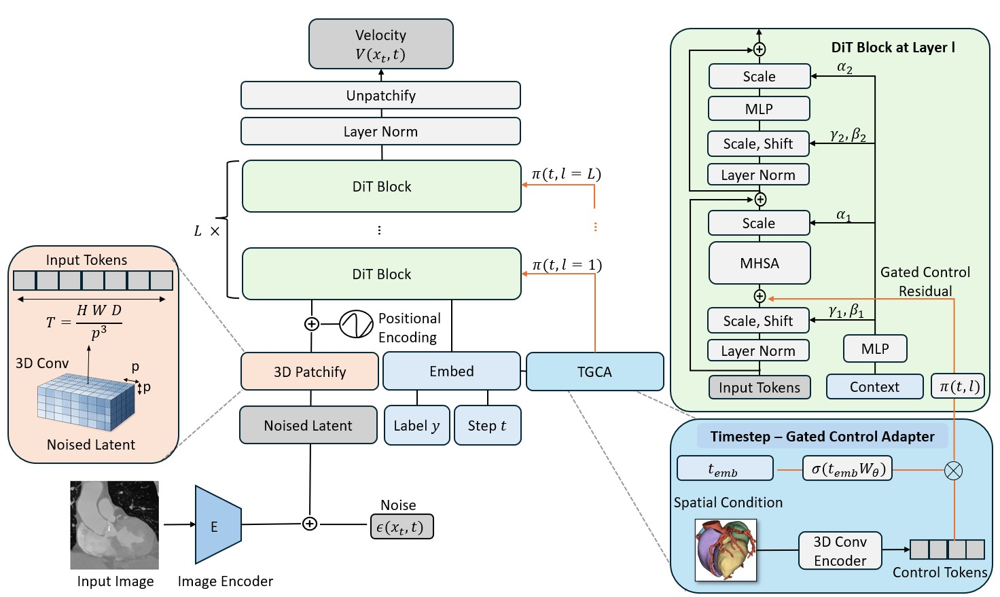

```{=html}
<link rel="stylesheet" href="viewer.css?v=3">
<link rel="stylesheet" href="project.css?v=3">
<article class="research-project">
<header class="project-hero">
<div class="project-inner">
<a class="project-back text-link" href="../../index.html#publications"><i class="bi bi-arrow-left" aria-hidden="true"></i> Publications</a>
<h1>VolDiT</h1>
<p class="project-subtitle">Controllable Volumetric Medical Image Synthesis<br>with Diffusion Transformers</p>
<p class="project-venue">MICCAI 2026</p>
<p class="project-authors"><a href="../../index.html#about">Marvin Seyfarth</a>, Salman Ul Hassan Dar, Yannik Frisch, Philipp Wild, Norbert Frey, Florian André, <a href="https://www.klinikum.uni-heidelberg.de/chirurgische-klinik-zentrum/herzchirurgie/forschung/institute-for-artificial-intelligence-in-cardiovascular-medicine-aicm/#layer=/personen/prof-dr-sandy-engelhardt-7654/">Sandy Engelhardt</a></p>
<div class="project-resources resource-links">
<a class="project-primary" href="https://arxiv.org/abs/2603.25181"><span class="project-resource-icon"><i class="bi bi-file-earmark-text" aria-hidden="true"></i></span><span>Paper</span></a>
<a href="https://github.com/Cardio-AI/voldit"><span class="project-resource-icon"><i class="bi bi-github" aria-hidden="true"></i></span><span>Code</span></a>
<a href="#citation"><span class="project-resource-icon"><i class="bi bi-quote" aria-hidden="true"></i></span><span>Cite this work</span></a>
</div>
</div>
</header>

<section class="project-showcase project-inner" aria-labelledby="examples-title">
<div class="showcase-heading"><h2 id="examples-title">Synthetic CT</h2></div>
<figure class="cine-figure">
<div class="cine-stage">
<video id="voldit-cine" controls loop playsinline preload="none" poster="assets/lung-example-1.jpg" aria-label="Synthetic lung CT example 1, scrolling through axial, coronal and sagittal views"><source src="assets/lung-example-1.mp4" type="video/mp4">Your browser cannot play this video. <a href="assets/lung-example-1.mp4">Open the synthetic CT example.</a></video>
</div>
<figcaption class="volume-plane-labels"><span>Axial</span><span>Coronal</span><span>Sagittal</span></figcaption>
<div class="voldit-samples" role="group" aria-label="Choose a synthetic CT video">
<div class="voldit-sample-group"><span>Lung CT</span><button type="button" data-cine="lung-example-1" aria-label="Lung CT example 1" aria-pressed="true" aria-controls="voldit-cine">01</button><button type="button" data-cine="lung-example-2" aria-label="Lung CT example 2" aria-pressed="false" aria-controls="voldit-cine">02</button></div>
<div class="voldit-sample-group"><span>TAVI-CT</span><button type="button" data-cine="tavi-example-1" aria-label="TAVI-CT example 1" aria-pressed="false" aria-controls="voldit-cine">01</button><button type="button" data-cine="tavi-example-2" aria-label="TAVI-CT example 2" aria-pressed="false" aria-controls="voldit-cine">02</button></div>
</div>
<noscript><p>More synthetic examples: <a href="assets/lung-example-2.mp4">Lung CT 2</a> · <a href="assets/tavi-example-1.mp4">TAVI-CT 1</a> · <a href="assets/tavi-example-2.mp4">TAVI-CT 2</a>.</p></noscript>
</figure>
<nav class="project-jump-links" aria-label="On this project page"><a href="#explore">Explore in 3D</a><a href="#overview">Overview</a><a href="#method">Method</a><a href="#results">Results</a><a href="#development">Ongoing work</a><a href="#citation">Citation</a></nav>
</section>

<section class="project-section" id="explore" aria-labelledby="explore-title"><div class="project-inner">
<h2 id="explore-title">Explore the full volume</h2>
<p class="project-reading">Rotate a synthetic CT, cut through the full volume, or inspect it slice by slice. Choose a lung or cardiac example and adjust the window to explore its anatomy.</p>
<section id="voldit-viewer" class="volume-viewer" data-manifest="assets/volumes.json?v=3" aria-label="Interactive 3D CT viewer">
<div class="volume-viewer-launch"><button type="button" class="volume-load-button">Load interactive volume <i class="bi bi-box" aria-hidden="true"></i></button><p class="volume-status" role="status" aria-live="polite">Loads on request · about 13 MB for the first volume and renderer.</p></div>
<div class="volume-viewer-stage" hidden></div>
<noscript><p>Enable JavaScript to explore the 3D volume, or view the videos above.</p></noscript>
</section>
<p class="project-source">Generated examples from the LUNA16 and TaviCT experiments. Lung volumes are reduced to 256 × 256 × 128 for the browser; cardiac volumes retain their original 192 × 192 × 192 resolution. Both preserve the full field of view and the original export intensity scale. Powered by <a href="https://niivue.com/">NiiVue</a>.</p>
</div></section>

<section class="project-section project-section--tinted" id="overview" aria-labelledby="overview-title"><div class="project-inner project-reading">
<h2 id="overview-title">Modeling anatomy in three dimensions</h2>
<p class="project-lead">A CT scan captures anatomy across a complete 3D volume. VolDiT models its spatial structure with a diffusion transformer operating on native 3D tokens.</p>
<p>The framework combines a compact volumetric autoencoder with global self-attention. A timestep-gated control adapter adds spatial guidance from segmentation masks, allowing the same backbone to support both unconditional and controlled synthesis.</p>
</div></section>

<section class="project-section" id="method" aria-labelledby="method-title"><div class="project-inner">
<h2 id="method-title">From 3D tokens to controlled synthesis</h2>
<figure class="project-framework"><a href="../../assets/paper-figures/voldit-figure-1-framework.jpg"></a><figcaption>The VolDiT framework. Figure 1 from the <a href="https://arxiv.org/html/2603.25181v1">preprint</a>. Select the diagram to enlarge it.</figcaption></figure>
<div class="method-steps"><div><h3>Compress the volume</h3><p>A volumetric VQ-GAN encodes the scan into a compact 3D latent representation.</p></div><div><h3>Learn global structure</h3><p>The diffusion transformer processes 3D patches with positional embeddings and global self-attention.</p></div><div><h3>Guide the anatomy</h3><p>The control adapter encodes segmentation masks as control tokens and gates their influence during denoising, keeping the pretrained backbone frozen.</p></div></div>
</div></section>

<section class="project-section project-section--tinted" id="results" aria-labelledby="results-title"><div class="project-inner">
<h2 id="results-title">Results from the paper</h2>
<p class="project-reading">VolDiT achieves the lowest test-set FID among the compared generators on both LUNA16 lung CT and the private TaviCT cohort. Each comparison uses 100 generated volumes.</p>
<div class="project-table-scroll" role="region" aria-label="LUNA16 generation results" tabindex="0"><table class="project-results"><caption>LUNA16 · 3D MedicalNet features</caption><thead><tr><th scope="col">Model</th><th scope="col">FID ↓</th><th scope="col">Precision ↑</th><th scope="col">Recall ↑</th></tr></thead><tbody><tr><th scope="row">U-Net LDM</th><td>0.031</td><td>0.44</td><td>0.94</td></tr><tr><th scope="row">HA-GAN</th><td>0.126</td><td>1.00</td><td>0.00</td></tr><tr class="result-highlight"><th scope="row">VolDiT (L, p=4)</th><td><strong>0.004</strong></td><td>0.91</td><td>0.90</td></tr></tbody></table></div>
<div class="project-table-scroll" role="region" aria-label="TaviCT generation results" tabindex="0"><table class="project-results"><caption>TaviCT · 2.5D ImageNet features</caption><thead><tr><th scope="col">Model</th><th scope="col">FID ↓</th><th scope="col">Precision ↑</th><th scope="col">Recall ↑</th></tr></thead><tbody><tr><th scope="row">U-Net LDM</th><td>36.8</td><td>0.95</td><td>0.63</td></tr><tr><th scope="row">HA-GAN</th><td>155.5</td><td>1.00</td><td>0.00</td></tr><tr class="result-highlight"><th scope="row">VolDiT (L, p=2)</th><td><strong>21.4</strong></td><td>0.94</td><td>0.73</td></tr></tbody></table></div>
<p class="project-source">Selected results from Table 1 of the <a href="https://arxiv.org/html/2603.25181v1">preprint</a>. FID values use different feature extractors and should only be compared within each dataset. ↓ Lower is better; ↑ higher is better.</p>
<h3 class="voldit-control-result">Spatial control from segmentation masks</h3><p class="project-reading">On TaviCT, the learned timestep gate achieves a median Dice score of 0.94 for the heart and 0.92 for the aorta, compared with 0.89 and 0.83 for the U-Net baseline. Full conditioning results and ablations are reported in Table 3.</p>
<details class="project-limitations"><summary>Scope and limitations</summary><p>The study uses fixed volume sizes and one autoencoder configuration per dataset. Larger transformers do not improve every metric under the tested training budgets. The interactive examples illustrate unconditional generation; they do not demonstrate segmentation control or establish clinical validity.</p></details>
</div></section>

<section class="project-section" id="development" aria-labelledby="development-title"><div class="project-inner">
<h2 id="development-title">Ongoing work</h2>
<p class="project-reading">Development continues in VolDiT v2, with experiments on alternative generative objectives and more explicit use of volume geometry.</p>
<div class="method-steps"><div><h3>Flow matching</h3><p>Exploring flow matching as an alternative training and sampling formulation for volumetric synthesis.</p></div><div><h3>Spacing-aware positions</h3><p>Investigating positional encodings that account for unequal spacing between volume axes.</p></div><div><h3>Latent normalization</h3><p>Studying channel-wise latent normalization and training schedules through controlled ablations.</p></div></div>
<p class="project-source">These directions are under investigation. The quantitative results above refer to the accepted work; quality or speed gains from these subsequent experiments have not been established here.</p>
</div></section>

<section class="project-section project-section--tinted" id="citation" aria-labelledby="citation-title"><div class="project-inner">
<h2 id="citation-title">Citation &amp; resources</h2>
<p>If this work supports your research, please cite the preprint.</p>
<pre class="project-bibtex"><code>@misc{seyfarth2026volditcontrollablevolumetricmedical,
  title   = {VolDiT: Controllable Volumetric Medical Image
             Synthesis with Diffusion Transformers},
  author  = {Marvin Seyfarth and Salman Ul Hassan Dar and
             Yannik Frisch and Philipp Wild and Norbert Frey and
             Florian André and Sandy Engelhardt},
  year    = {2026},
  eprint  = {2603.25181},
  archivePrefix = {arXiv},
  primaryClass  = {cs.CV},
  url     = {https://arxiv.org/abs/2603.25181}
}</code></pre>
<div class="resource-links"><a href="https://arxiv.org/abs/2603.25181"><i class="bi bi-file-earmark-text" aria-hidden="true"></i> Read the paper</a><a href="https://github.com/Cardio-AI/voldit"><i class="bi bi-github" aria-hidden="true"></i> Explore the code</a><a href="https://huggingface.co/AICM-HD/voldit"><i class="bi bi-box-arrow-up-right" aria-hidden="true"></i> Pretrained models</a><a href="assets/voldit.bib" download><i class="bi bi-download" aria-hidden="true"></i> Download BibTeX</a></div>
</div></section>
</article>
<script src="project.js?v=3" defer></script>
<script type="module" src="viewer.js?v=3"></script>
```
